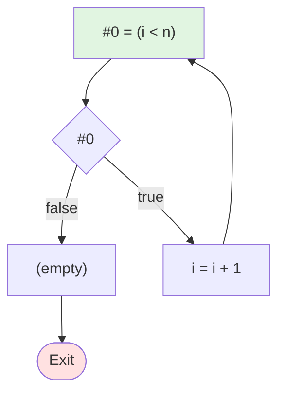

# WhileD 语言控制流图生成器

程序语言与编译原理课程编程作业 (SJTU-CS2612)

## 项目简介

将 WhileD 语言的抽象语法树 (AST) 转换为控制流图 (CFG)，生成线性化的中间表示 (IR)。

## 核心功能

✅ **智能表达式处理**: 简单运算直接生成，复杂表达式自动拆分  
✅ **短路求值**: `&&` 和 `||` 转换为控制流  
✅ **控制结构**: 支持 `while` 循环和 `if-else` 分支  
✅ **指针操作**: 支持取址 (`&`) 和解引用 (`*`)  
✅ **两阶段转换**: LABEL → BB → Mermaid 可视化  

## 快速开始

### 运行演示

```bash
# 终端演示（2个示例程序）
python demo.py

# 终端演示 + 生成 Mermaid 文件（6个测试用例）
python demo.py --generate

# 运行所有测试用例
python main.py
```

### 使用示例

```python
from ast_definition import *
from cfg_generator import CFGGenerator

# 构建 AST: while (i < n) do { i = i + 1 }
program = CWhile(
    EBinop("<", EVar("i"), EVar("n")),
    CAsgnVar("i", EBinop("+", EVar("i"), EConst(1)))
)

# 生成 CFG
generator = CFGGenerator()
cfg = generator.generate_cfg(program)

# 阶段1：表达式拆分（使用 LABEL）
cfg.print_linear_ir()

# 阶段2：基本块（使用 BB）
cfg.print_blocks_structure()

# 阶段3：流程图（Mermaid）
print(cfg.to_mermaid())
```

### 输出示例

**阶段1：表达式拆分 (LABEL)**
```
LABEL_1:
    #0 = (i < n)
    if (! #0) then jmp LABEL_2
    i = i + 1
    jmp LABEL_1
LABEL_2:
```

**阶段2：基本块 (BB)**
```
BB_1:
    #0 = (i < n)
    if (! #0) then jmp BB_2
    i = i + 1
    jmp BB_1
BB_2:
```

**阶段3：控制流图 (Mermaid 文件)**


## 项目结构

```
.
├── ast_definition.py      # WhileD AST 节点定义
├── ir_representation.py   # IR 指令和 CFG 类
├── cfg_generator.py       # AST → CFG 转换逻辑
├── demo.py                # 演示程序（终端演示 + Mermaid 文件生成）
├── main.py                # 测试用例（10 个测试）
├── mermaid_outputs/       # 生成的流程图（运行 demo.py --generate 后）
├── README.md              # 项目说明文档（本文件）
└── TEST.md                # 测试说明文档
```

### 文档说明

- **README.md**: 项目概述、快速开始、实现原理、使用示例
- **TEST.md**: 详细的测试用例说明，包括测试目的、输入、预期输出和验证方法

## 实现原理

### 算法概述

本实现采用**两阶段转换**策略，将 WhileD 语言的 AST 转换为控制流图：

1. **阶段1：AST → 线性 IR（带标签）**
   - 递归遍历 AST，将表达式和语句转换为线性 IR 指令序列
   - 为控制流结构（`if`, `while`）生成标签和跳转指令
   - 处理短路求值，将 `&&` 和 `||` 转换为条件跳转

2. **阶段2：线性 IR → 基本块 CFG**
   - 使用 **Leader 算法**识别基本块入口
   - 将线性指令序列分割为基本块
   - 建立基本块之间的前驱/后继关系，形成 CFG

### 核心算法：Leader 算法

**基本块（Basic Block）**定义：一个连续执行的指令序列，有唯一的入口点和出口点。

**Leader（基本块入口）识别规则**：
1. 第一条指令是 Leader
2. 任何跳转指令的目标是 Leader
3. 任何跳转指令的下一条指令是 Leader

**算法流程**：
```
1. 扫描线性 IR，识别所有 Leader 位置
2. 在 Leader 之间划分指令，形成基本块
3. 分析每个基本块的终止指令（跳转/条件跳转/顺序执行）
4. 根据终止指令建立基本块之间的边（successors/predecessors）
```

### 表达式处理策略

#### 简单表达式优化
对于简单的一元/二元运算，直接生成单条 IR 指令，避免不必要的临时变量：
- `y = x + 1` → `y = x + 1`（一条指令）
- `y = -x` → `y = - x`（一条指令）
- `y = *p` → `y = *p`（一条指令）

#### 复杂表达式拆分
对于嵌套表达式，递归拆分并引入临时变量：
- `y = (x+1)*2` → `#0 = x + 1; y = #0 * 2`

#### 短路求值转换

**`&&` 运算符**（`e1 && e2`）：
```
1. 计算 e1，结果存入 result
2. if (! result) then jmp FALSE_LABEL
3. 计算 e2，结果存入 result
4. jmp END_LABEL
FALSE_LABEL:
5. result = e1  (保留左操作数的实际值)
END_LABEL:
```

**`||` 运算符**（`e1 || e2`）：
```
1. 计算 e1，结果存入 result
2. if (result) then jmp TRUE_LABEL
3. 计算 e2，结果存入 result
4. jmp END_LABEL
TRUE_LABEL:
5. result = e1  (保留左操作数的实际值)
END_LABEL:
```

### 控制流结构转换

#### While 循环
```python
while (cond) do body
```
转换为：
```
START_LABEL:
  [cond 的 IR 指令]
  if (! cond_var) then jmp END_LABEL
  [body 的 IR 指令]
  jmp START_LABEL
END_LABEL:
```

#### If-Else 分支
```python
if (cond) then then_branch else else_branch
```
转换为：
```
  [cond 的 IR 指令]
  if (! cond_var) then jmp ELSE_LABEL
  [then_branch 的 IR 指令]
  jmp END_LABEL
ELSE_LABEL:
  [else_branch 的 IR 指令]
END_LABEL:
```

### IR 语法规范

- **关键字**: 全小写 (`if`, `then`, `else`, `jmp`)
- **临时变量**: `#0`, `#1`, `#2`, ... (仅用于复杂表达式)
- **标签**: 
  - 阶段1: `LABEL_1:`, `LABEL_2:`, ...
  - 阶段2: `BB_1:`, `BB_2:`, ...
- **条件跳转**: `if (! condition) then jmp LABEL_N`
- **无条件跳转**: `jmp LABEL_N`
- **表达式优化**: 
  - 简单运算：`y = x + 1`（一条指令）
  - 复杂运算：`#0 = x + 1; y = #0 * 2`（拆分）

### 转换流程

```
源程序 → AST
       ↓
阶段1: 表达式拆分 (LABEL)
       ↓
阶段2: 基本块 (BB) - Leader 算法
       ↓
阶段3: 流程图 (Mermaid)
```

### 代码结构说明

- **`ast_definition.py`**: 定义 WhileD 语言的 AST 节点类
- **`ir_representation.py`**: 定义 IR 指令类型、基本块和 CFG 类，包含打印和可视化方法
- **`cfg_generator.py`**: 核心转换逻辑
  - `flatten_expr()`: 表达式线性化
  - `flatten_shortcircuit()`: 短路求值处理
  - `process_statement()`: 语句处理（阶段1）
  - `build_cfg()`: 基本块构建（阶段2，Leader 算法）
  - `generate_cfg()`: 主入口，完成完整转换

## 示例程序

### 示例1：简单循环

```python
program = CWhile(
    EBinop("<", EVar("i"), EVar("n")),
    CAsgnVar("i", EBinop("+", EVar("i"), EConst(1)))
)
```

### 示例2：短路求值

```python
program = CAsgnVar(
    "result",
    EBinop("&&",
        EVar("p"),
        EBinop("!=", EDeref(EVar("p")), EConst(0))
    )
)
```

### 示例3：If-Else

```python
program = CIf(
    EBinop(">", EVar("x"), EConst(0)),
    CAsgnVar("y", EVar("x")),
    CAsgnVar("y", EUnop("-", EVar("x")))
)
```

### 示例4：指针操作

```python
program = CSeq(
    CAsgnVar("p", EAddrOf(EVar("x"))),
    CAsgnDeref(EVar("p"), EConst(10))
)
```

## 依赖

仅需 Python 3.10+ 标准库，无需安装额外包。

## 可视化

### 方法1：终端查看

```python
print(cfg.to_mermaid())
```

将输出复制到 https://mermaid.live/ 即可查看图形化流程图。

### 方法2：生成 Mermaid 文件

```bash
python demo.py --generate
```

生成 6 个测试用例的 Mermaid 流程图，保存到 `mermaid_outputs/` 目录：

| 文件 | 描述 |
|------|------|
| `test1_while_loop.md` | While 循环 |
| `test2_if_else.md` | If-Else 分支 |
| `test3_shortcircuit_and.md` | 短路求值 AND |
| `test4_shortcircuit_or.md` | 短路求值 OR |
| `test5_nested.md` | 嵌套控制流 |
| `test6_pointer.md` | 指针操作 |

每个文件包含：
- 📊 Mermaid 流程图代码
- 📝 阶段1：表达式拆分 (LABEL)
- 📦 阶段2：基本块 (BB)