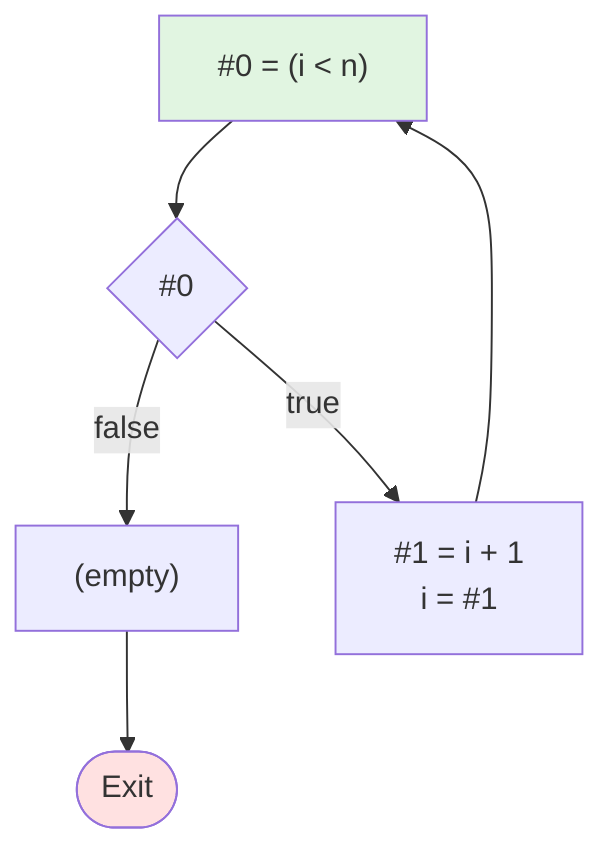

# WhileD 语言控制流图生成器

程序语言与编译原理课程编程作业 (SJTU-CS2612)

## 项目简介

将 WhileD 语言的抽象语法树 (AST) 转换为控制流图 (CFG)，生成线性化的中间表示 (IR)。

## 核心功能

✅ **表达式拆分**: 复杂表达式线性化为单步操作  
✅ **短路求值**: `&&` 和 `||` 转换为控制流  
✅ **控制结构**: 支持 `while` 循环和 `if-else` 分支  
✅ **指针操作**: 支持取址 (`&`) 和解引用 (`*`)  
✅ **两阶段转换**: LABEL → BB  

## 快速开始

### 运行演示

```bash
# 终端演示（2个示例程序）
python demo.py

# 终端演示 + 生成 Mermaid 文件（6个测试用例）
python demo.py --generate

# 运行所有测试用例
python main.py
```

### 使用示例

```python
from ast_definition import *
from cfg_generator import CFGGenerator

# 构建 AST: while (i < n) do { i = i + 1 }
program = CWhile(
    EBinop("<", EVar("i"), EVar("n")),
    CAsgnVar("i", EBinop("+", EVar("i"), EConst(1)))
)

# 生成 CFG
generator = CFGGenerator()
cfg = generator.generate_cfg(program)

# 阶段1：表达式拆分（使用 LABEL）
cfg.print_linear_ir()

# 阶段2：基本块（使用 BB）
cfg.print_blocks_structure()

# 阶段3：流程图（Mermaid）
print(cfg.to_mermaid())
```

### 输出示例

**阶段1：表达式拆分 (LABEL)**
```
LABEL_1:
    #0 = (i < n)
    if (! #0) then jmp LABEL_2
    #1 = i + 1
    i = #1
    jmp LABEL_1
LABEL_2:
```

**阶段2：基本块 (BB)**
```
BB_1:
    #0 = (i < n)
    if (! #0) then jmp BB_2
    #1 = i + 1
    i = #1
    jmp BB_1
BB_2:
```

**阶段3：控制流图 (Mermaid 文件)**


## 项目结构

```
.
├── ast_definition.py      # WhileD AST 节点定义
├── ir_representation.py   # IR 指令和 CFG 类
├── cfg_generator.py       # AST → CFG 转换逻辑
├── demo.py                # 演示程序（终端演示 + Mermaid 文件生成）
├── main.py                # 测试用例
├── mermaid_outputs/       # 生成的流程图（运行 demo.py --generate 后）
└── README.md              # 本文件
```

## 实现特性

### 两阶段转换

1. **阶段1：表达式拆分** - 使用 `LABEL_1`, `LABEL_2`, ...
   - 完成表达式线性化
   - 处理短路求值
   - 生成标签和跳转

2. **阶段2：基本块** - 使用 `BB_1`, `BB_2`, ...
   - 将 LABEL 转换为 BB
   - 形成基本块结构
   - 等价于 CFG

3. **阶段3：流程图** - Mermaid 可视化
   - 访问 https://mermaid.live/
   - 粘贴生成的代码查看图形

### IR 语法规范

- **关键字**: 全小写 (`if`, `then`, `else`, `jmp`)
- **临时变量**: `#0`, `#1`, `#2`, ...
- **标签**: 
  - 阶段1: `LABEL_1:`, `LABEL_2:`, ...
  - 阶段2: `BB_1:`, `BB_2:`, ...
- **条件跳转**: `if (! condition) then jmp LABEL_N`
- **无条件跳转**: `jmp LABEL_N`
- **每行一操作**: 表达式完全线性化

### 转换流程

```
源程序 → AST
       ↓
阶段1: 表达式拆分 (LABEL)
       ↓
阶段2: 基本块 (BB)
       ↓
阶段3: 流程图 (Mermaid)
```

## 示例程序

### 示例1：简单循环

```python
program = CWhile(
    EBinop("<", EVar("i"), EVar("n")),
    CAsgnVar("i", EBinop("+", EVar("i"), EConst(1)))
)
```

### 示例2：短路求值

```python
program = CAsgnVar(
    "result",
    EBinop("&&",
        EVar("p"),
        EBinop("!=", EDeref(EVar("p")), EConst(0))
    )
)
```

### 示例3：If-Else

```python
program = CIf(
    EBinop(">", EVar("x"), EConst(0)),
    CAsgnVar("y", EVar("x")),
    CAsgnVar("y", EUnop("-", EVar("x")))
)
```

### 示例4：指针操作

```python
program = CSeq(
    CAsgnVar("p", EAddrOf(EVar("x"))),
    CAsgnDeref(EVar("p"), EConst(10))
)
```

## 依赖

仅需 Python 3.10+ 标准库，无需安装额外包。

## 可视化

### 方法1：终端查看

```python
print(cfg.to_mermaid())
```

将输出复制到 https://mermaid.live/ 即可查看图形化流程图。

### 方法2：生成 Mermaid 文件

```bash
python demo.py --generate
```

生成 6 个测试用例的 Mermaid 流程图，保存到 `mermaid_outputs/` 目录：

| 文件 | 描述 |
|------|------|
| `test1_while_loop.md` | While 循环 |
| `test2_if_else.md` | If-Else 分支 |
| `test3_shortcircuit_and.md` | 短路求值 AND |
| `test4_shortcircuit_or.md` | 短路求值 OR |
| `test5_nested.md` | 嵌套控制流 |
| `test6_pointer.md` | 指针操作 |

每个文件包含：
- 📊 Mermaid 流程图代码
- 📝 阶段1：表达式拆分 (LABEL)
- 📦 阶段2：基本块 (BB)