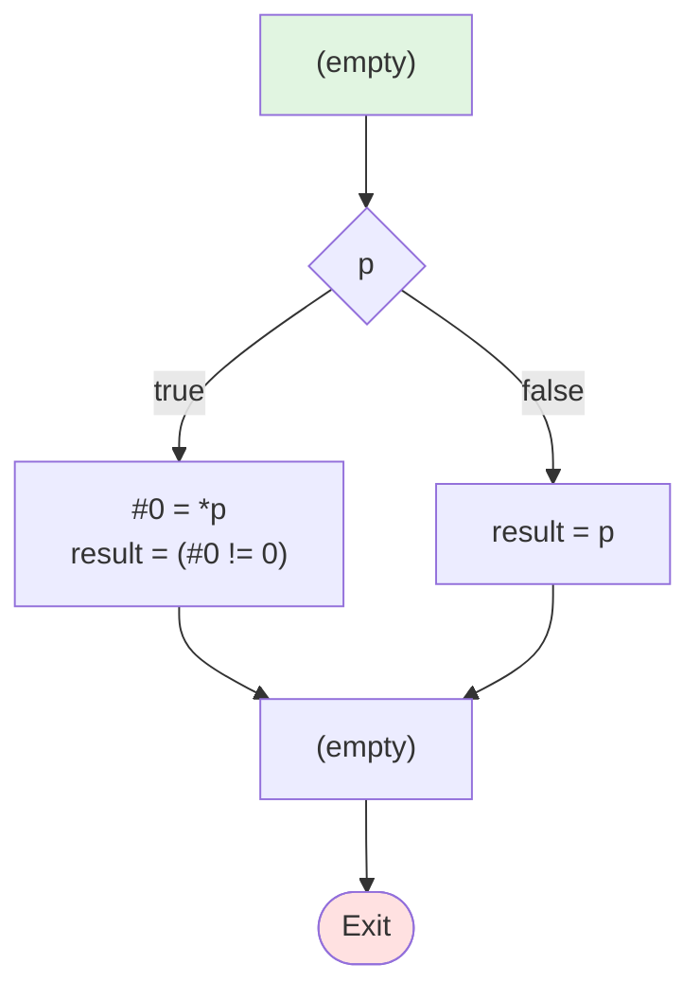

# 测试3：短路求值AND

**描述**: result = p && (*p != 0)

## 阶段1：表达式拆分 (LABEL)

```
LABEL_entry:
    if (! p) then jmp LABEL_1
    #0 = *p
    result = (#0 != 0)
    jmp LABEL_2
LABEL_1:
    result = p
LABEL_2:
```

## 阶段2：基本块 (BB)

```
BB_1:
    if (! p) then jmp BB_2
    #0 = *p
    result = (#0 != 0)
    jmp BB_3
BB_2:
    result = p
BB_3:
```

## 阶段3：控制流图


