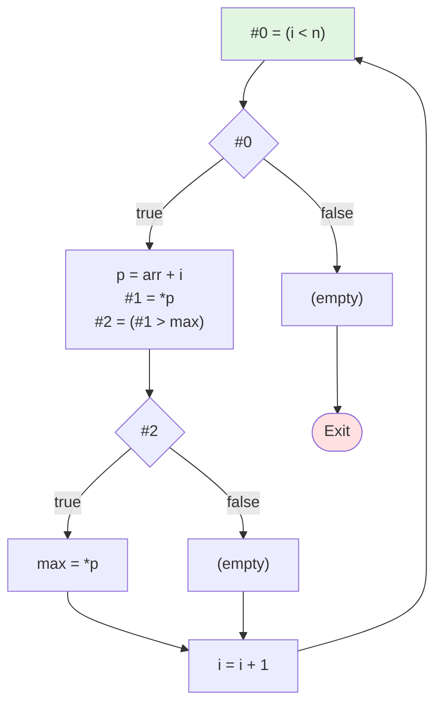

# 测试 10: 综合测试

**源程序**: `while (i < n) do { p = arr + i; if (*p > max) then max = *p else skip; i = i + 1 }`

## 阶段1：表达式拆分 (LABEL)

```
LABEL_1:
    #0 = (i < n)
    if (! #0) then jmp LABEL_2
    p = arr + i
    #1 = *p
    #2 = (#1 > max)
    if (! #2) then jmp LABEL_3
    max = *p
    jmp LABEL_4
LABEL_3:
LABEL_4:
    i = i + 1
    jmp LABEL_1
LABEL_2:
```

## 阶段2：基本块 (BB)

```
BB_1:
    #0 = (i < n)
    if (! #0) then jmp BB_4
    p = arr + i
    #1 = *p
    #2 = (#1 > max)
    if (! #2) then jmp BB_2
    max = *p
    jmp BB_3
BB_2:
BB_3:
    i = i + 1
    jmp BB_1
BB_4:
```

## 阶段3：控制流图


