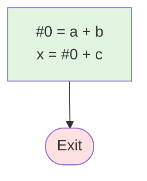

# 测试 1: 表达式拆分

**源程序**: `x = a + b + c`

## 阶段1：表达式拆分 (LABEL)

```
LABEL_entry:
    #0 = a + b
    x = #0 + c
```

## 阶段2：基本块 (BB)

```
BB_1:
    #0 = a + b
    x = #0 + c
```

## 阶段3：控制流图


```mermaid
flowchart TD
    B0["#0 = a + b<br/>x = #0 + c"]

    B0 --> Exit([Exit])

    style B0 fill:#e1f5e1
    style Exit fill:#ffe1e1
```
