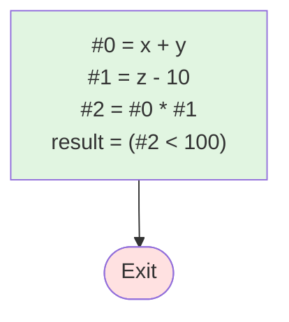

# 测试 2: 嵌套表达式

**源程序**: `result = (x + y) * (z - 10) < 100`

## 阶段1：表达式拆分 (LABEL)

```
LABEL_entry:
    #0 = x + y
    #1 = z - 10
    #2 = #0 * #1
    result = (#2 < 100)
```

## 阶段2：基本块 (BB)

```
BB_1:
    #0 = x + y
    #1 = z - 10
    #2 = #0 * #1
    result = (#2 < 100)
```

## 阶段3：控制流图


