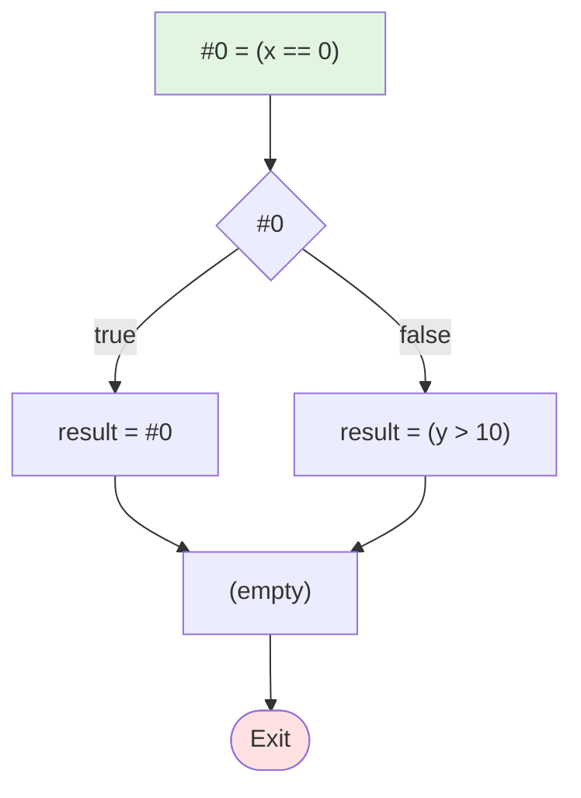

# 测试 4: 短路求值 OR

**源程序**: `result = x == 0 || y > 10`

## 阶段1：表达式拆分 (LABEL)

```
LABEL_entry:
    #0 = (x == 0)
    if (! #0) then jmp LABEL_1
    result = #0
    jmp LABEL_2
LABEL_1:
    result = (y > 10)
LABEL_2:
```

## 阶段2：基本块 (BB)

```
BB_1:
    #0 = (x == 0)
    if (! #0) then jmp BB_2
    result = #0
    jmp BB_3
BB_2:
    result = (y > 10)
BB_3:
```

## 阶段3：控制流图


