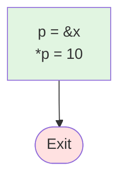

# 测试 7: 指针操作

**源程序**: `p = &x; *p = 10`

## 阶段1：表达式拆分 (LABEL)

```
LABEL_entry:
    p = &x
    *p = 10
```

## 阶段2：基本块 (BB)

```
BB_1:
    p = &x
    *p = 10
```

## 阶段3：控制流图


```mermaid
flowchart TD
    B0["p = &amp;x<br/>*p = 10"]

    B0 --> Exit([Exit])

    style B0 fill:#e1f5e1
    style Exit fill:#ffe1e1
```
