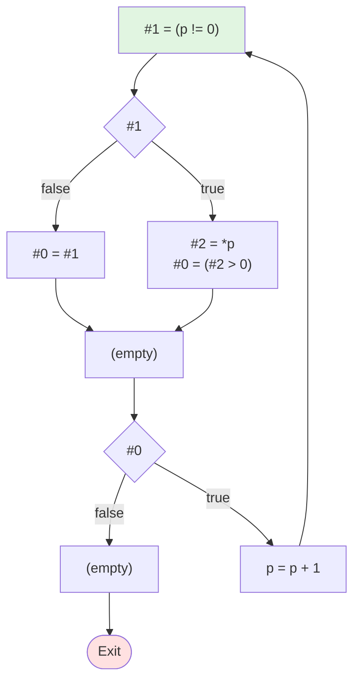

# 测试 8: While 循环（带短路求值）

**源程序**: `while (p != 0 && *p > 0) do { p = p + 1 }`

## 阶段1：表达式拆分 (LABEL)

```
LABEL_1:
    #1 = (p != 0)
    if (! #1) then jmp LABEL_3
    #2 = *p
    #0 = (#2 > 0)
    jmp LABEL_4
LABEL_3:
    #0 = #1
LABEL_4:
    if (! #0) then jmp LABEL_2
    p = p + 1
    jmp LABEL_1
LABEL_2:
```

## 阶段2：基本块 (BB)

```
BB_1:
    #1 = (p != 0)
    if (! #1) then jmp BB_2
    #2 = *p
    #0 = (#2 > 0)
    jmp BB_3
BB_2:
    #0 = #1
BB_3:
    if (! #0) then jmp BB_4
    p = p + 1
    jmp BB_1
BB_4:
```

## 阶段3：控制流图


