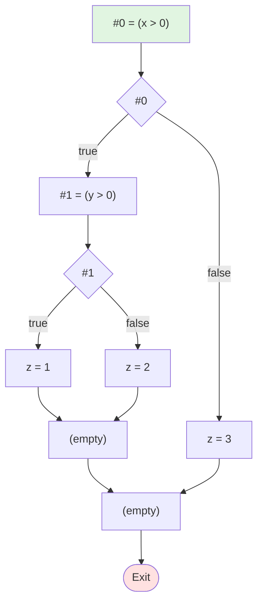

# 测试 9: 嵌套 If-Else

**源程序**: `if (x > 0) then { if (y > 0) then z = 1 else z = 2 } else z = 3`

## 阶段1：表达式拆分 (LABEL)

```
LABEL_entry:
    #0 = (x > 0)
    if (! #0) then jmp LABEL_1
    #1 = (y > 0)
    if (! #1) then jmp LABEL_3
    z = 1
    jmp LABEL_4
LABEL_3:
    z = 2
LABEL_4:
    jmp LABEL_2
LABEL_1:
    z = 3
LABEL_2:
```

## 阶段2：基本块 (BB)

```
BB_1:
    #0 = (x > 0)
    if (! #0) then jmp BB_4
    #1 = (y > 0)
    if (! #1) then jmp BB_2
    z = 1
    jmp BB_3
BB_2:
    z = 2
BB_3:
    jmp BB_5
BB_4:
    z = 3
BB_5:
```

## 阶段3：控制流图


