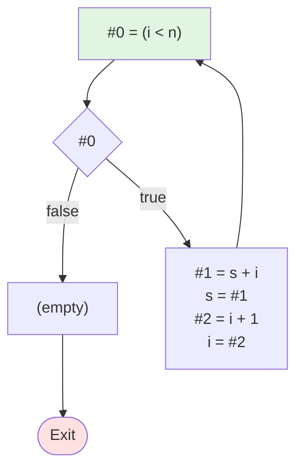

# 测试1：简单While循环

**描述**: while (i < n) do { s = s + i; i = i + 1 }

## 流程图



## 阶段1：表达式拆分 (LABEL)

```
LABEL_1:
    #0 = (i < n)
    if (! #0) then jmp LABEL_2
    #1 = s + i
    s = #1
    #2 = i + 1
    i = #2
    jmp LABEL_1
LABEL_2:
```

## 阶段2：基本块 (BB)

```
BB_1:
    #0 = (i < n)
    if (! #0) then jmp BB_2
    #1 = s + i
    s = #1
    #2 = i + 1
    i = #2
    jmp BB_1
BB_2:
```
