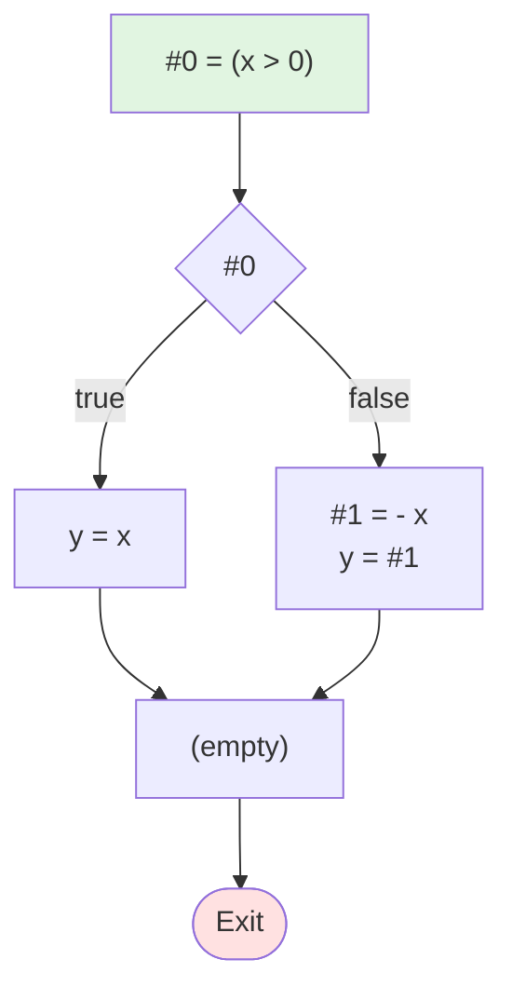

# 测试2：If-Else分支

**描述**: if (x > 0) then y = x else y = -x

## 流程图



## 阶段1：表达式拆分 (LABEL)

```
LABEL_entry:
    #0 = (x > 0)
    if (! #0) then jmp LABEL_1
    y = x
    jmp LABEL_2
LABEL_1:
    #1 = - x
    y = #1
LABEL_2:
```

## 阶段2：基本块 (BB)

```
BB_1:
    #0 = (x > 0)
    if (! #0) then jmp BB_2
    y = x
    jmp BB_3
BB_2:
    #1 = - x
    y = #1
BB_3:
```
