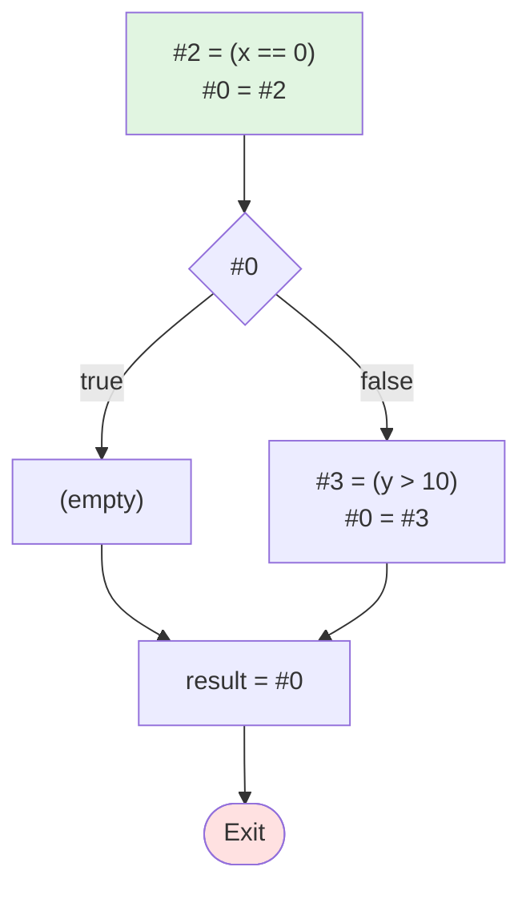

# 测试4：短路求值OR

**描述**: result = (x == 0) || (y > 10)

## 流程图



## 阶段1：表达式拆分 (LABEL)

```
LABEL_entry:
    #2 = (x == 0)
    #0 = #2
    if (! #0) then jmp LABEL_4
    jmp LABEL_5
LABEL_4:
    #3 = (y > 10)
    #0 = #3
LABEL_5:
    result = #0
```

## 阶段2：基本块 (BB)

```
BB_1:
    #2 = (x == 0)
    #0 = #2
    if (! #0) then jmp BB_2
    jmp BB_3
BB_2:
    #3 = (y > 10)
    #0 = #3
BB_3:
    result = #0
```
