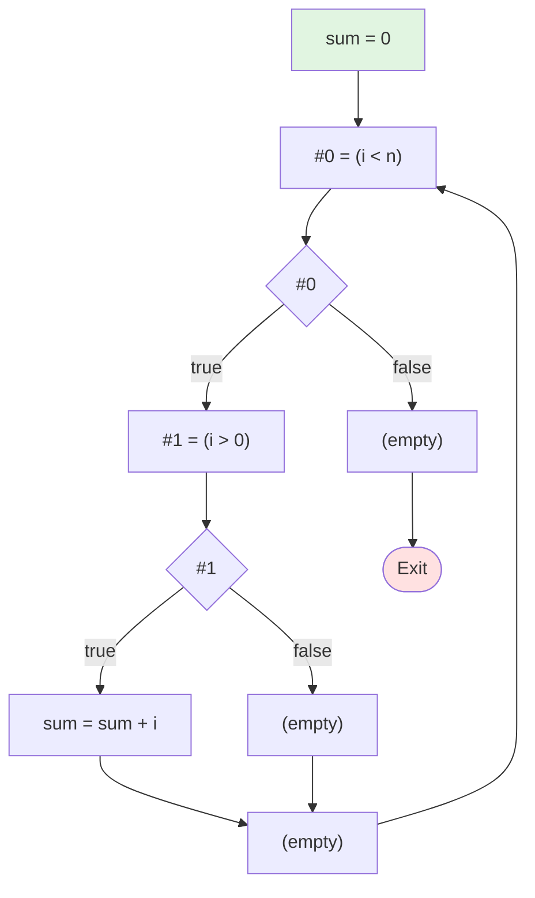

# 测试5：嵌套控制流

**描述**: sum = 0; while (i < n) do { if (i > 0) then sum = sum + i else skip }

## 流程图



## 阶段1：表达式拆分 (LABEL)

```
LABEL_entry:
    sum = 0
LABEL_1:
    #0 = (i < n)
    if (! #0) then jmp LABEL_2
    #1 = (i > 0)
    if (! #1) then jmp LABEL_3
    sum = sum + i
    jmp LABEL_4
LABEL_3:
LABEL_4:
    jmp LABEL_1
LABEL_2:
```

## 阶段2：基本块 (BB)

```
BB_1:
    sum = 0
BB_2:
    #0 = (i < n)
    if (! #0) then jmp BB_5
    #1 = (i > 0)
    if (! #1) then jmp BB_3
    sum = sum + i
    jmp BB_4
BB_3:
BB_4:
    jmp BB_2
BB_5:
```
