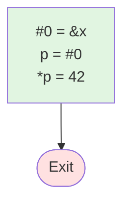

# 测试6：指针操作

**描述**: p = &x; *p = 42

## 流程图


```mermaid
flowchart TD
    B0["#0 = &amp;x<br/>p = #0<br/>*p = 42"]

    B0 --> Exit([Exit])

    style B0 fill:#e1f5e1
    style Exit fill:#ffe1e1
```

## 阶段1：表达式拆分 (LABEL)

```
LABEL_entry:
    #0 = &x
    p = #0
    *p = 42
```

## 阶段2：基本块 (BB)

```
BB_1:
    #0 = &x
    p = #0
    *p = 42
```
